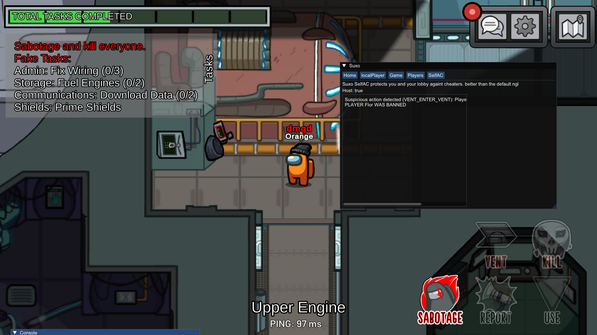
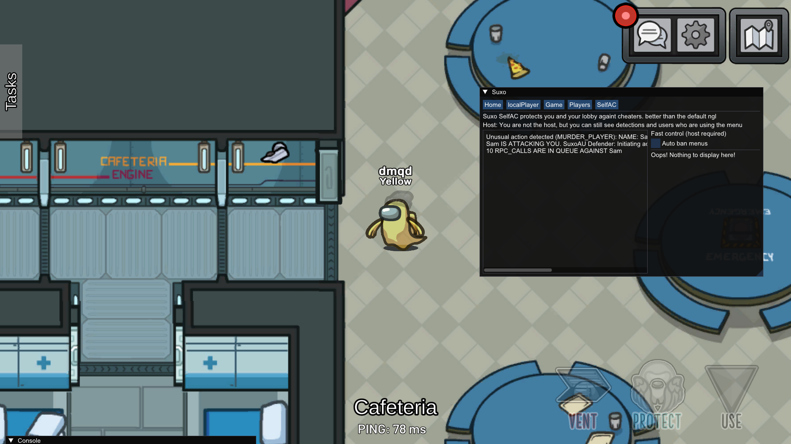

# SuxoAU
Among Us cheat

**Source code soon!! (i dont like skids (specially [Sony](https://github.com/Dx2AV)))**

meanwhile you can disassemble it or whathever

**Credits:**
- [IL2CppDumper](https://github.com/Perfare/Il2CppDumper)

# Presence
- SuxoAU includes rich presence for discord

# Features

**LocalPlayer**
- Unlock vents
- Always Chat
- See players roles
- See ghosts
- See ghost chats
- No kill cooldown
- Wallhack
- Unlock all cosmetics
  
**Players:**
  - See roles, host, cheat menu
  - See their tasks if completed or not
  - Kick/Ban (host)
  - Set Names (host)
  - Shapeshift (role)
  - Goto
  - Murder Player (if you are host it justs changes the role to ghost)
    
**Game:**
  - Start meeting
  - Complete all tasks
  - Murder all
  - Close meeting (Host)
  - End game (host (unstable))
  - Disable lights
  - Sabotage reactor, o2, laboratory, mushroom mixup, comms, airship thingy

# SelfAC
SelfAC is a feature that includes advanced detectors to identify other players using cheats. It is designed to work effectively when you are hosting a game, allowing you to take control in the lobby.

Recommended Usage: When you plan to host a lobby to ensure a fair and controlled gameplay environment.

**Detections:**
- **Murder Detection:** Detects unusual killing behaviour.
- **Vent Usage Detection:** Detects players who cannot use vents.
- **Sabotage Detection:** Detects unusual or extra sabotages.
- **Menu Detection:** Detects other cheat menus, such as AUM and S1kcoMenu.
- **ETC...**

**Features:**
  - Auto ban menus

**Vent detection:**

SuxoAUDefender_counterattack.png
## SuxoAU Defender

This is a local-side version of SelfAC that includes:
 - Protection against being killed by other players due to unusual behavior, with automatic counterattack using 10 RPC calls against the attacker.

**Here what happends when a player kills u**
- Note: After the counterattack, theres a **HIGH** chance the attacker will be kicked from the game, just like in the image below:

**Note:** 
- This feature is still in the testing phase and may not work perfectly in all situations. Im actively working to improve it.
